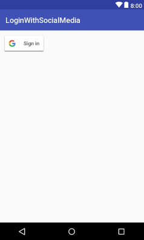

# LoginWithSocialMedia
Login with Google+

### ScreenShoot

To integrate Google Sign-In into your Android app, configure Google Sign-In and add a button to your app's layout that starts the sign-in flow.
